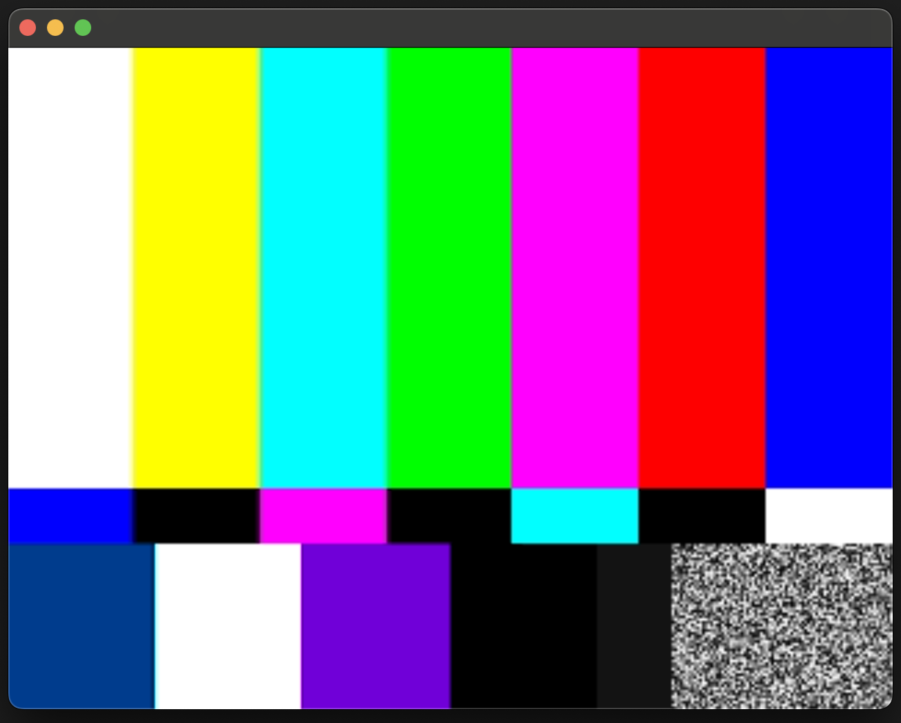
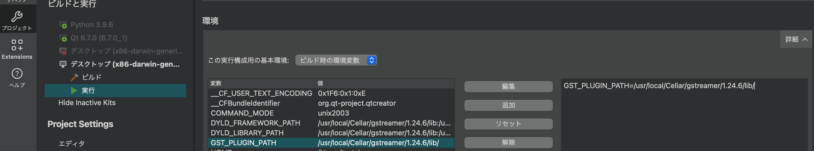

# mac-on-qml6glsink

## MacでGstreamerプラグインのqml6glsinkが動かせなくてお困りの方へ

* brew で gst-plugins-good を インストールしても qml6glsink が含まれていないため動かせません。

### でも、プラグインを自分でビルドすれば動かせます。

Gstreamer の ver 1.24.5 で試しています。


qml6glsinkプラグインのソースコードは[こちら](https://gitlab.freedesktop.org/gstreamer/gstreamer/-/tree/1.24/subprojects/gst-plugins-good/ext/qt6?ref_type=heads)にあります。  
そして公式のサンプルコードは[こちら](https://gitlab.freedesktop.org/gstreamer/gstreamer/-/tree/1.24/subprojects/gst-plugins-good/tests/examples/qt6/qmlsink?ref_type=heads)にあります。  
このディレクトリには２つとも同梱されています。  


### まず、シェーダをコンパイルします。サンプルコードでも使います
```bash
cd qt6/

qsb --glsl=100,120 --batchable --output vertex.vert.qsb vertex.vert
qsb --glsl=100,120 --batchable --output RGBA.frag.qsb RGBA.frag
qsb --glsl=100,120 --batchable --output YUV_TRIPLANAR.frag.qsb YUV_TRIPLANAR.frag

qsb --glsl=100,120 --batchable --output ../qmlsink/vertex.vert.qsb vertex.vert
qsb --glsl=100,120 --batchable --output ../qmlsink/RGBA.frag.qsb RGBA.frag
qsb --glsl=100,120 --batchable --output ../qmlsink/YUV_TRIPLANAR.frag.qsb YUV_TRIPLANAR.frag
```

### 次にプラグインをビルドして確認します
```bash
qmake
make

# ビルドに成功したらgstreamerにコピー
cp libgstqml6.dylib /usr/local/Cellar/gstreamer/1.24.5/lib/

# プラグインのキャッシュをクリア
gst-inspect-1.0 --gst-disable-registry-update --gst-plugin-path=/usr/local/Cellar/gstreamer/1.24.5/lib/

export GST_PLUGIN_PATH=/usr/local/Cellar/gstreamer/1.24.5/lib/

# 確認
gst-inspect-1.0 qml6glsink
# QML debugging is enabled. Only use this in a safe environment.
# Factory Details:
#   Rank                     none (0)
#   Long-name                Qt6 Video Sink
#   Klass                    Sink/Video
#   Description              A video sink that renders to a QQuickItem for Qt6
#   Author                   Matthew Waters <matthew@centricular.com>
```

### そして、サンプルコードで実行してみます。
```bash
cd ../qmlsink 
qmake
make
GST_DEBUG=3 ./build/x86_darwin_generic_mach_o_64bit-Debug/play.app/Contents/MacOS/play
```

### QtCreatorで実行する時はパスを通す必要があります

